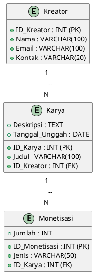
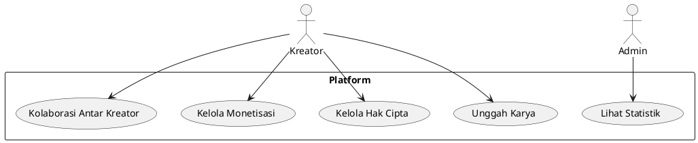
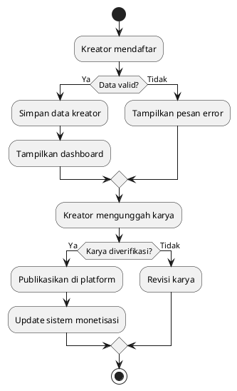

# Laporan Analisis Platform Berbagi Karya Seni dan Kreativitas

## 1. Latar Belakang

Karya seni dan kreativitas memiliki peran penting dalam mengekspresikan ide dan budaya serta menginspirasi masyarakat. Namun, banyak seniman dan kreator yang mengalami kesulitan dalam mempublikasikan, mendistribusikan, dan mendapatkan apresiasi terhadap karya mereka.

Saat ini, masih banyak kreator yang bergantung pada media sosial atau metode manual untuk berbagi karya, yang sering kali kurang optimal dalam memberikan eksposur dan perlindungan hak cipta. Oleh karena itu, diperlukan platform berbasis teknologi yang memungkinkan para kreator untuk berbagi, mempromosikan, dan mendokumentasikan karya seni mereka secara lebih efektif.

## 2. Identifikasi Masalah

Beberapa permasalahan utama yang dihadapi oleh kreator dalam berbagi karya seni dan kreativitas adalah:

1. Kesulitan dalam mendokumentasikan dan mempublikasikan karya seni secara profesional.
2. Kurangnya platform yang mendukung distribusi dan promosi karya secara luas.
3. Minimnya sistem perlindungan hak cipta terhadap karya digital.
4. Kesulitan dalam berkolaborasi dengan kreator lain dan membangun komunitas seni.
5. Kurangnya akses ke sistem monetisasi yang transparan dan adil.

## 3. Rumusan Masalah

1. Bagaimana membangun platform berbasis teknologi yang memungkinkan kreator untuk berbagi dan mendokumentasikan karya mereka?
2. Bagaimana sistem ini dapat membantu dalam promosi dan distribusi karya seni secara luas?
3. Bagaimana platform ini dapat menyediakan perlindungan hak cipta bagi karya seni yang dibagikan?
4. Bagaimana sistem ini dapat mempermudah kolaborasi dan interaksi antar kreator?
5. Bagaimana platform ini dapat menyediakan sistem monetisasi yang adil bagi para kreator?

## 4. Tujuan Penelitian

1. Mengembangkan platform berbagi karya seni yang terstruktur dan mudah diakses.
2. Membangun fitur untuk promosi dan distribusi karya seni secara lebih luas.
3. Menyediakan sistem perlindungan hak cipta bagi kreator.
4. Mengembangkan fitur kolaborasi untuk memperkuat komunitas kreator.
5. Menyediakan sistem monetisasi yang transparan dan adil bagi kreator.

## 5. Metode Analisis

### 5.1. What (Apa)
- Platform ini bertujuan untuk meningkatkan eksposur dan perlindungan karya seni melalui pendekatan berbasis teknologi.
- Masalah utama yang ingin diselesaikan adalah kesulitan dalam berbagi, mendokumentasikan, dan memonetisasi karya seni.

### 5.2. Why (Mengapa)
- Platform ini diperlukan untuk meningkatkan efisiensi kreator dalam membagikan karya mereka dan mendapatkan apresiasi yang layak.
- Laravel dipilih karena fleksibilitasnya dalam pengembangan web, Docker untuk memastikan lingkungan pengembangan konsisten, dan MySQL untuk penyimpanan data terstruktur.

### 5.3. Who (Siapa)
- Platform ini melibatkan seniman, kreator, kolektor seni, dan komunitas seni.
- Pengguna utama adalah kreator yang ingin membagikan, melindungi, dan memonetisasi karya mereka.

### 5.4. When (Kapan)
- Implementasi sistem direncanakan dalam waktu enam bulan setelah tahap pengembangan dan pengujian.
- Evaluasi sistem dilakukan setiap enam bulan untuk penyesuaian fitur dan kebutuhan kreator.

### 5.5. Where (Di Mana)
- Platform ini akan digunakan oleh komunitas kreator dan dapat diakses melalui web dashboard.
- Data disimpan dalam database MySQL yang dapat dihosting secara lokal atau di cloud.

### 5.6. How (Bagaimana)
- Sistem dikembangkan menggunakan Laravel untuk backend dan frontend, Docker untuk containerisasi, serta MySQL untuk penyimpanan data.
- Kreator mendaftar, mengunggah karya, mendapatkan eksposur, dan sistem menyediakan laporan otomatis serta fitur monetisasi.

## 6. Perancangan Sistem

### 6.1. Entity Relationship Diagram (ERD)



### 6.2. Use Case Diagram



### 6.3. Flowchart



### 6.4. Implementasi Database (SQL)

```sql
CREATE TABLE Kreator (
    ID_Kreator INT PRIMARY KEY AUTO_INCREMENT,
    Nama VARCHAR(100),
    Email VARCHAR(100),
    Kontak VARCHAR(20)
);

CREATE TABLE Karya (
    ID_Karya INT PRIMARY KEY AUTO_INCREMENT,
    Judul VARCHAR(100),
    Deskripsi TEXT,
    Tanggal_Unggah DATE,
    ID_Kreator INT,
    FOREIGN KEY (ID_Kreator) REFERENCES Kreator(ID_Kreator)
);

CREATE TABLE Monetisasi (
    ID_Monetisasi INT PRIMARY KEY AUTO_INCREMENT,
    Jenis VARCHAR(50),
    Jumlah INT,
    ID_Karya INT,
    FOREIGN KEY (ID_Karya) REFERENCES Karya(ID_Karya)
);
```

## 7. Kesimpulan

Platform berbagi karya seni berbasis Laravel, Docker, dan MySQL ini bertujuan untuk meningkatkan eksposur, perlindungan hak cipta, serta monetisasi bagi para kreator. Dengan sistem ini, kreator dapat berbagi karya mereka dengan aman, mendapatkan pengakuan, dan berkolaborasi dengan komunitas seni secara lebih luas.
